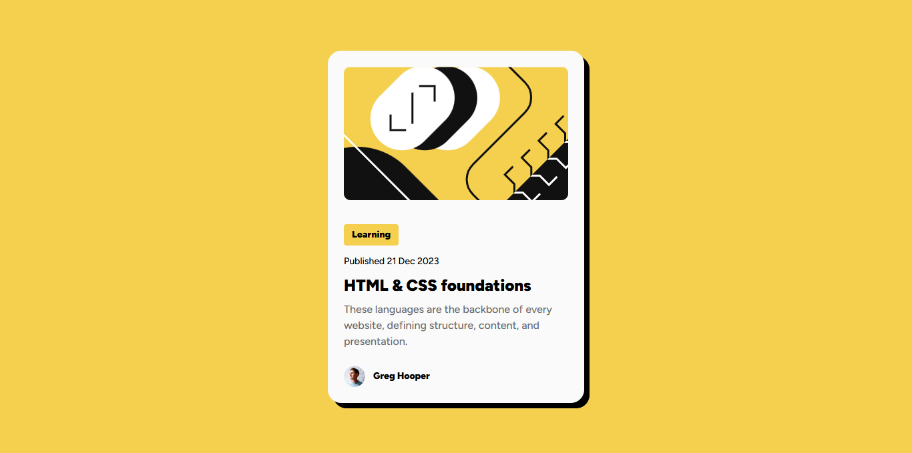

# Frontend Mentor - Blog preview card solution

This is a solution to the [Blog preview card challenge on Frontend Mentor](https://www.frontendmentor.io/challenges/blog-preview-card-ckPaj01IcS). Frontend Mentor challenges help me improve my coding skills by building realistic projects.

## Table of contents

- [Overview](#overview)
  - [The challenge](#the-challenge)
  - [Screenshot](#screenshot)
  - [Links](#links)
- [My process](#my-process)
  - [Built with](#built-with)
  - [What I learned](#what-i-learned)
  - [Continued development](#continued-development)
  - [Useful resources](#useful-resources)
- [Author](#author)

**Note: Delete this note and update the table of contents based on what sections you keep.**

## Overview

### The challenge

Ideas to test Myself

1. Focus on writing semantic HTML and using the correct elements based on the content.
2. Train my eye for detail by making your solution look similar to the design.
3. The font sizes in this project are slightly smaller in the mobile layout. Find a way to reduce font size for smaller screens without using media queries.
4. Add animation for the card by SASS.

Users should be able to:

- See hover and focus states for all interactive elements on the page
- See the intro Animation when loading the page

### Screenshot



### Links

- Solution URL: [The solution URL here](https://github.com/Mohammed-Osama-pg/FdMr-blog-preview-card.git)
- Live Site URL: [The live site URL here](https://your-live-site-url.com)

## My process

### Built with

- Semantic HTML5 markup
- SASS for CSS
- Flexbox
- Mobile-first workflow

### What I learned

I learn how to work with animation in SASS like :

```scss
@keyframes intro-animation {
  0% {
    width: 60px;
    height: 60px;
    background: #f0f0f0;
    box-shadow: 0 0 0 #cccccc, 0 0 0 #ffffff, 10px 10px 10px #cccccc inset, -10px -10px
        10px #ffffff inset;
  }
  25% {
    width: 60px;
    height: 60px;
    background: #f8f8f8;
    box-shadow: 10px 10px 0 rgba(0, 0, 0), 10px 10px 10px #cccccc,
      0 0 0 #cccccc inset, 0 0 0 #ffffff inset;
  }
  50% {
    width: 60px;
    height: 522px;
    background: #f8f8f8;
    box-shadow: 10px 10px 0 rgba(0, 0, 0), 10px 10px 10px #cccccc,
      0 0 0 #cccccc inset, 0 0 0 #ffffff inset;
  }
  98% {
    width: 384px;
    height: auto;
    background: #fafafa;
    box-shadow: 8px 8px 0 rgba(0, 0, 0), 0 0 0 #ffffff, 0 0 0 #cccccc inset, 2px
        2px 2px #ffffff inset;
  }
  100% {
    width: clamp(327px, 40vw, 384px);
    height: auto;
    background: #fafafa;
    box-shadow: 8px 8px 0 rgba(0, 0, 0);
  }
}
```

reduce font size without using media queries

- We can make font sizes responsive using the vw unit, where (1vw) equals 1% of the viewport width. This means as the viewport width changes, the font size will change proportionally.
- We can also use the clamp function to set a minimum and maximum font size so that the font size will never be too small or too large.

```scss
@mixin text-preset-1 {
  font-size: clamp(20px, 2.5vw, 24px);
  // min 20px mobile:375px           max 24px 1440px desktop
  font-weight: 900;
}
@mixin text-preset-2 {
  font-size: clamp(14px, 1.5vw, 16px);
  // min 14px mobile:375px            max 16px 1440px desktop
  font-weight: normal;
}
@mixin text-preset-3 {
  font-size: clamp(12px, 1.25vw, 14px);
  // min 12px mobile:375px            max 14px 1440px desktop
  font-weight: normal;
}
@mixin text-preset-4 {
  font-size: clamp(12px, 1.25vw, 14px);
  // min 12px mobile:375px            max 14px 1440px desktop
  font-weight: 900;
}
```

### Continued development

I need to know how to structure my SASS files when working with projects and I use BEM to name classes but I don't think I do it the right way.

### Useful resources

- semantic HTML:
  [Why & When to Use Semantic HTML Elements over Divs](https://www.youtube.com/watch?v=bOUhq46fd5g).

- reduce font size without using media queries :

  - What is Clamp function :
    The clamp() CSS function clamps a middle value within a range of values between a defined minimum bound and a maximum bound. The function takes three parameters: a minimum value, a preferred value, and a maximum allowed value; [ for more info check ](https://developer.mozilla.org/en-US/docs/Web/CSS/clamp).

- Animation and animation in SASS :

  - [The basics of animation](https://www.youtube.com/watch?v=z2LQYsZhsFw)
  - [Animation ideas](https://freefrontend.com/css-animation-examples/)
  - [The chosen animation](https://codepen.io/ma_suwa/pen/eYdZVML)

## Author

- GitHub - [My Github](https://github.com/Mohammed-Osama-pg)
- Frontend Mentor - [My Frontend Mentor](https://www.frontendmentor.io/profile/Mohammed-Osama-pg)
